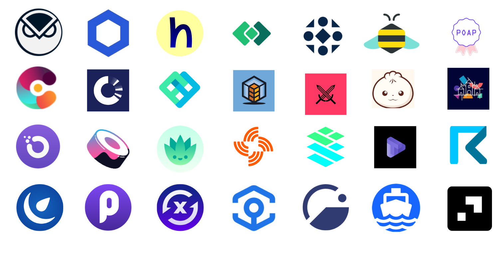

# Welcome to Gnosis Chain🦉


**Token Merger Completed**\
****STAKE to GNO swap has been completed. xDai Chain is now Gnosis Chain. For further information, read more at: [https://www.gnosischain.com/evm](https://www.gnosischain.com/evm)



📺 **Videos covering the latest ecosystem developments** are live on our [YouTube Channel](https://www.youtube.com/channel/UC93IarcktP0-dZzpI\_vvO3g). Subscribe today!\
\
:love\_letter: **For weekly updates and news on all things Gnosis Chain**, check out our [Substack Newsletter](https://gnosischain.substack.com/).


## :chains: Gnosis Chain


Brand new? [Get started here](for-users/getting-started-with-gc/).


The Gnosis Chain is a stable payments EVM (Ethereum Virtual Machine) blockchain designed for fast and inexpensive transactions. The chain uses a unique dual-token model; [xDai ](for-users/get-xdai-tokens/)is a stable token used for transactions, payments, and fees, and Proof of Stake protection will be provided by GNO with the consensus-layer Gnosis Beacon Chain. &#x20;

|               | xDai ⚔                                           | GNO 🦸                                                               |
| ------------- | ------------------------------------------------ | -------------------------------------------------------------------- |
| **Purpose**   | 
Stable Payments Transaction (gas) Fees
 | 
Staking &#x26; Protocol Protection

Community Governance
 |
| **Stability** | Stable to USD                                    | Volatile / Market Driven                                             |

## 🌉 Bridges&#x20;

[Bridges](about-gc/faqs/bridges-xdai-bridge-and-omnibridge.md) provide the seamless ability to move tokens between chains using the unique [TokenBridge Architecture](https://docs.tokenbridge.net/). Tokens and arbitrary messages can also be passed across chain.&#x20;

* [xDai Bridge](for-users/bridges/converting-xdai-via-bridge/): More info on converting Dai to xDai and bridge xDai to Dai on Ethereum.
* [Omnibridge](for-users/bridges/omnibridge/): More info on bridging ERC20 tokens between Ethereum and GC or between Binance Smart Chain and GC.&#x20;

## 🔎 BlockScout Block Explorer&#x20;

[BlockScout](https://blockscout.com/xdai/mainnet) is an open-source explorer providing transactional transparency, custom features and a portal for GC apps such as xDai staking, the xDai faucet, cross-chain bridge access and monitoring.

## 📊 Chain Usage&#x20;

Stats available on [Dune Analytics](https://duneanalytics.com/maxaleks/xDai-Usage) custom dashboards.

## :mountain: Project Highlights

The Gnosis/xDai ecosystem continues to flourish with many new project migrations, integrations, applications, and a mature toolset for developers. Explore the depth of the ecosystem in the [Project & DApps](about-gc/project-spotlights/) section, or visit [https://gnosischain.world/](https://gnosischain.world/) to see and interact with active projects.

| Integrations                                        | Infrastructure                                            | DeFi                                                                    | NFTs                                                  | DAOs                                              |
| --------------------------------------------------- | --------------------------------------------------------- | ----------------------------------------------------------------------- | ----------------------------------------------------- | ------------------------------------------------- |
| [Gnosis](about-gc/project-spotlights/gnosis/)       | [Origin Trail](https://origintrail.io/)                   | [HoneySwap](about-gc/project-spotlights/1hive/honeyswap.md)             | [POAP](https://www.poap.xyz/)                         | [DaoHaus](about-gc/project-spotlights/daohaus.md) |
| [Chainlink](about-gc/project-spotlights/chainlink/) | [RealT](https://realt.co/)                                | [Perpetual Protocol](about-gc/project-spotlights/perpetual-protocol.md) | [Nifty.Ink](about-gc/project-spotlights/nifty.ink.md) | [Colony](https://colony.io/)                      |
| [HOPR](https://hoprnet.org/)                        | [Circles UBI](about-gc/project-spotlights/circles-ubi.md) | [Curve Finance](https://xdai.curve.fi/)                                 | [Unifty](https://unifty.io)                           | [DXdao](https://dxdao.medium.com/)                |
| [Ramp Network](https://ramp.network/)               | [Streamr](https://streamr.network/)                       | [SushiSwap](https://sushi.com/)                                         | [Crypto Stamps](https://crypto.post.at/)              | [RaidGuild](https://raidguild.org/)               |
| [Giveth](https://giveth.io/)                        | [Orchid](https://www.orchid.com/)                         | [BaoSwap](https://www.bao.finance/)                                     | [Cargo](https://cargo.build)                          | [Peerion](https://peerion.io/pools/)              |
| [Tenderly](https://tenderly.co/)                    | [CardStack](https://cardstack.com/)                       | [Omen](https://xdai.omen.eth.link/#/liquidity)                          | [Eporio](https://epor.io/)                            |                                                   |
| [Ankr](https://www.ankr.com/)                       | [Request](https://request.network/en/)                    | [Swapr](https://swapr.eth.link/#/swap)                                  | [Unique.One](https://www.unique.one/)                 |                                                   |
| [Tornado Cash](https://tornado.cash/)               | [clr. Fund](about-gc/project-spotlights/clr-fund.md)      | [Agave](https://agave.finance/)                                         | [xlr8r](https://xlr8r.com/)                           |                                                   |
| [Token Multisender](https://multisender.app/)       |                                                           | [Component Finance](about-gc/project-spotlights/component-finance.md)   | [Genuino](https://www.genuino.world/world/sport)      |                                                   |

## 🛠 **For Developers**


🛠 See [Developer Resources and Tools](for-developers/developer-resources/) to get up-and-running quickly.


Development on GC is easy and intuitive for Ethereum developers. GC is an EVM chain, and smart contracts can be written and deployed in exactly the same way simply by setting a [different RPC endpoint.](for-developers/developer-resources/#json-rpc-endpoints)

Any contract that works on the Ethereum mainnet can be redeployed to the Gnosis chain. Transaction costs are minimized, and all fees and transactions are paid with a single token, xDai. **Many tools supporting Ethereum development** are compatible with GC, including:

* [TheGraph](https://thegraph.com/)
* [Tenderly](https://tenderly.co/)
* [Remix](https://remix-project.org/)
* [OpenZeppelin](https://openzeppelin.com/)
* [BlockNative](https://www.blocknative.com/)
* [Gnosis Safe MultiSig](https://gnosis-safe.io/)
* [Dune Analytics](https://duneanalytics.com/home)
* Many more......

## **Why Gnosis/xDai?**

* ✅Fast transaction times (5 seconds) & low transaction fees (500 tx for $.01).
* ✅Digital cash. A stable chain is ideal for real world value exchange where 1 xDai = 1 US Dollar.
* ✅A stable token for transactions & gas fees.
* ✅A green, energy-efficient and [ecologically aware](about-gc/news-and-information/xdai-energy-efficiency/) blockchain network.
* ✅Permissionless delegated Proof-Of-Stake based consensus with public [POSDAO](for-validators/posdao-whitepaper.md).
* ✅Wide-ranging Community Support (see [xDai Validator Organizations](broken-reference)).
* ✅Extreme usability with tools like [Burner Wallet](for-users/wallets/burner-wallet/) & [Burner Wallet 2](for-users/wallets/burner-wallet-2.md).
* ✅Growing ecosystem designed to support stable person-to-person transactions, micro transactions, [conference currencies](about-gc/use-cases/cryptocurrency-for-events-and-conferences/), [community currencies](about-gc/use-cases/community-currencies.md), DeFi, NFTs, DAOs, games and more.
* ✅Full-featured  [BlockScout Explorer](https://blockscout.com/xdai/mainnet).
* ✅On-chain, decentralized [Random Number Generator](for-developers/on-chain-random-numbers/).
* ✅Smart Contract, DApp & toolset compatibility with other Ethereum-based chains like Ethereum, Ethereum Classic, BSC and others.
* ✅Experiencing the [magic of crypto](about-gc/news-and-information/media-articles/crypto-influencers-on-xdai.md#anthony-pompliano) for the first time!
