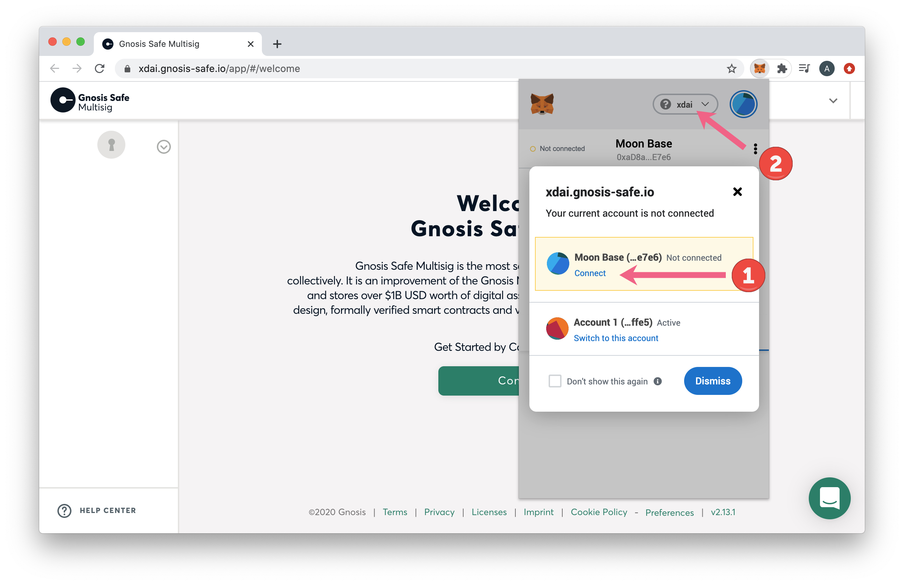
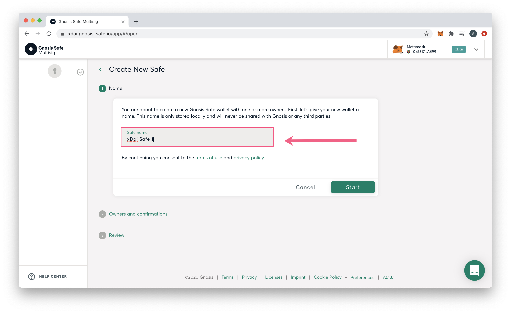
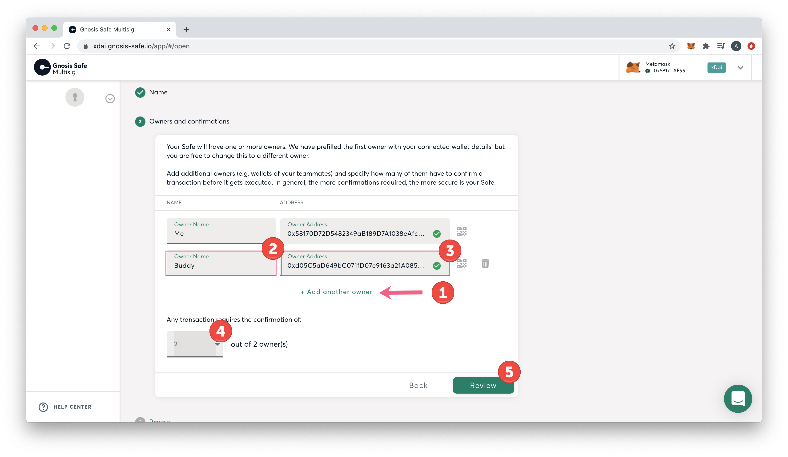
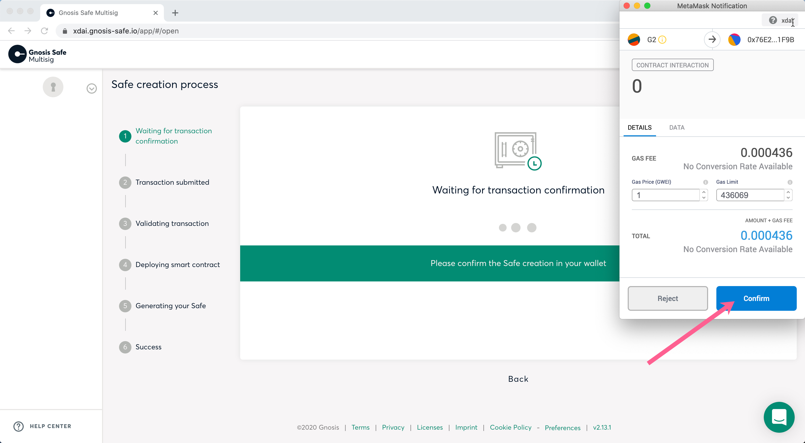
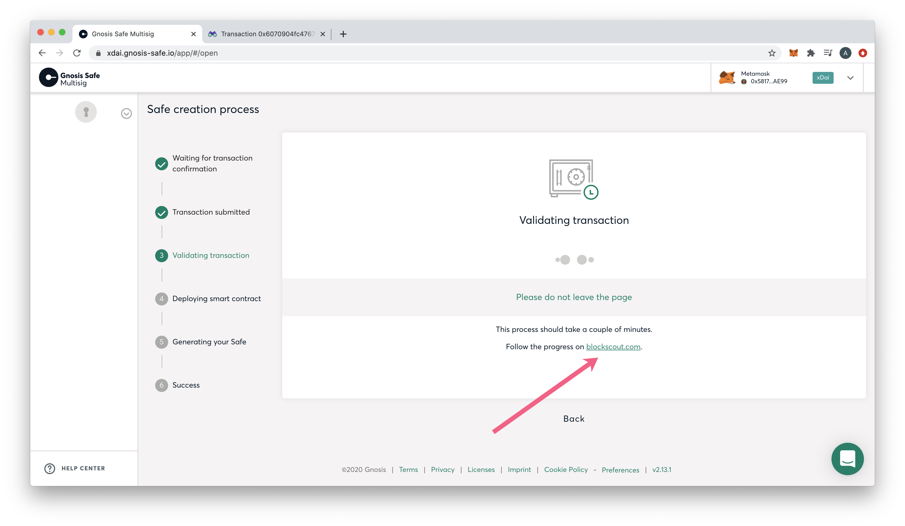
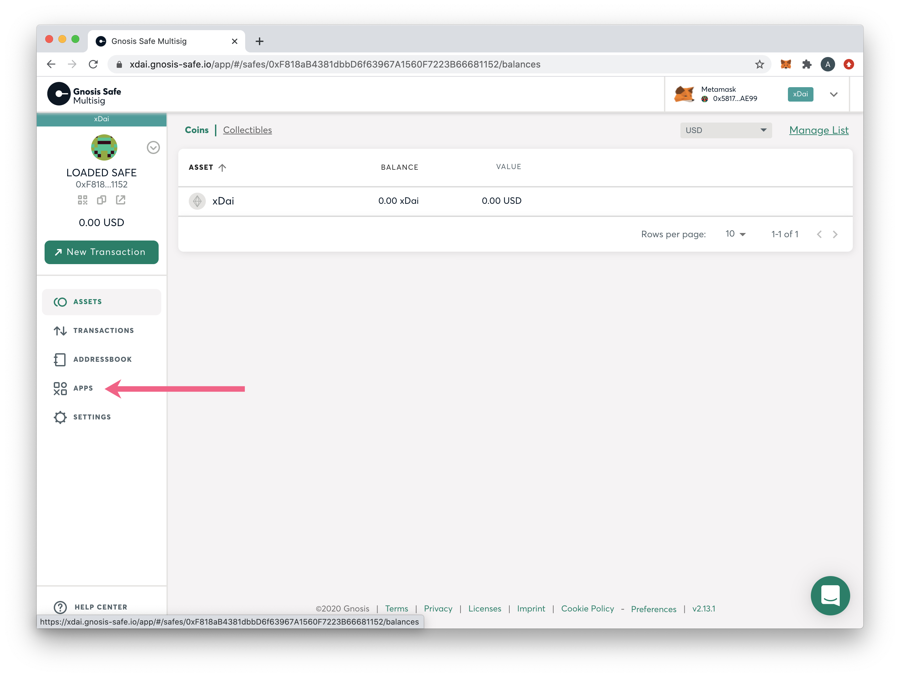
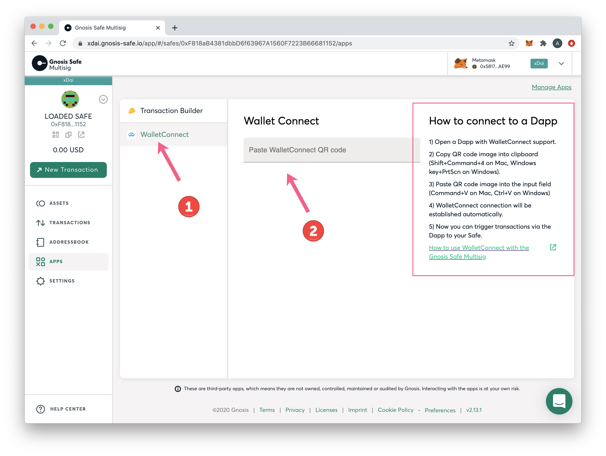
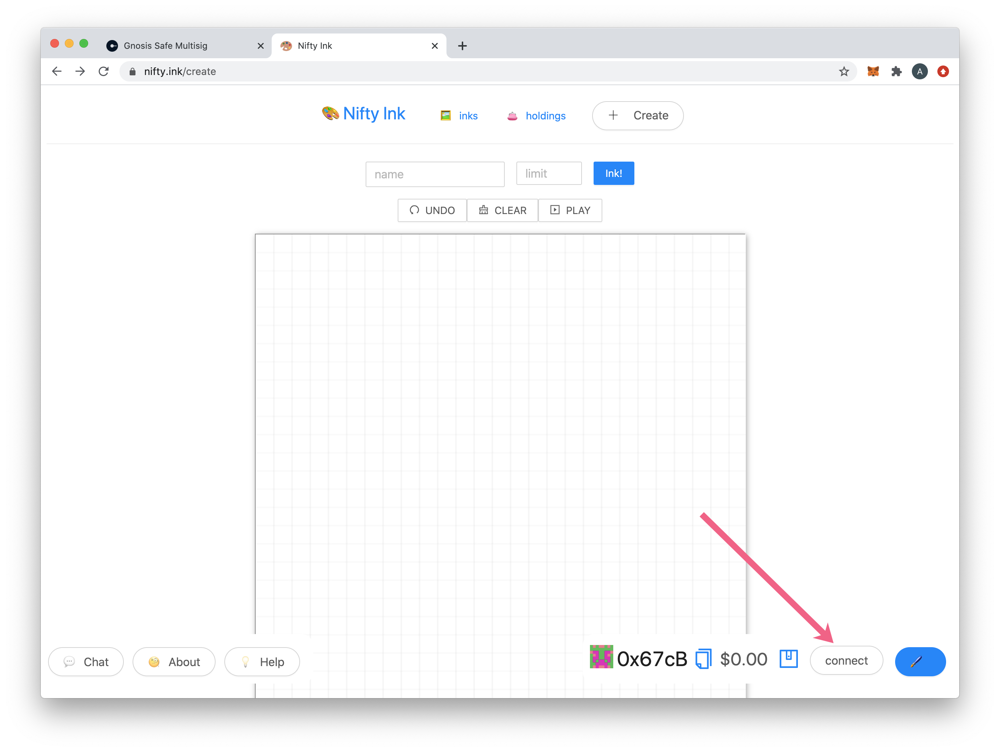
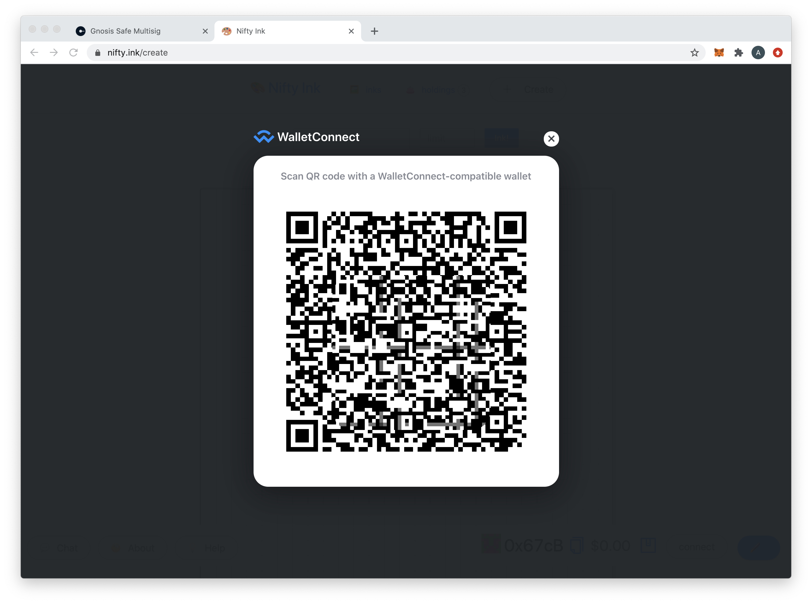

# Gnosis Safe

## Gnosis Safe on Gnosis Chain

* Safe Application on GC: [https://xdai.gnosis-safe.io/app/#/welcome](https://xdai.gnosis-safe.io/app/#/welcome)
* Safe Tutorials by Gnosis: [https://help.gnosis-safe.io/en/](https://help.gnosis-safe.io/en/)

## Connect a Wallet

There are several options including MetaMask, hardware wallets, and WalletConnect. WalletConnect allows you to use a 3rd party wallet on your mobile device.&#x20;

1\) Go to the Safe application on xDai at [https://xdai.gnosis-safe.io/app/#/welcome](https://xdai.gnosis-safe.io/app/#/welcome). Click Connect.

.jpg>)

2\) Chose your wallet.&#x20;


We recommend MetaMask.


.jpg>)

### Connecting with MetaMask

1\) Select the MetaMask option in the connect wallet menu. Check that the correct MetaMask account is active and connected to the xDai Network. [Need to add xDai to your MetaMask?](../../../for-users/wallets/metamask/metamask-setup.md)


For more information, see this article by Gnosis: [https://help.gnosis-safe.io/en/articles/4552860-how-to-use-the-gnosis-safe-on-xdai-with-metamask](https://help.gnosis-safe.io/en/articles/4552860-how-to-use-the-gnosis-safe-on-xdai-with-metamask)


### Connecting with WalletConnect

Current WalletConnect functionality is limited to wallets that support xDai. You can use MetaMask Mobile with wallet connect if you have setup the [xDai custom RPC](../../../for-users/wallets/metamask/metamask-setup.md).&#x20;


Note: Some features may not work as expected on xDai, currently we recommend using MetaMask browser extension.


If you choose to use WalletConnect, select the WalletConnect option in the connect wallet menu. Scan the QR code with your application and accept the message to connect in your mobile wallet.

## Create A New Safe

1\) Press **Create new Safe**.

2\) Name the safe. This will be stored locally. Press **Start t**o continue.

3\) Add additional owners if wanted. For each additional owner:

1. Click Add another owner.
2. Give Owner a Name.
3. Enter Owner Address.
4. Select how many owners will be required to confirm a transaction.
5. Press Review.

4\) Confirm the transaction. You will need a very small amount of xDai to confirm the tx.

5\) During deployment you can check safe creation on BlockScout. Click the link to view progress.&#x20;

## Deposit Assets

When sending to your new safe, make sure you are connected to the xDai Chain, copy the Safe address, and process as you would any other xDai transaction. For more information, see this tutorial from Gnosis:



## Connect a DApp with WalletConnect

You can connect to WalletConnect to interact with supported DApps using Gnosis Safe.

1\) Go to APPS in the navigation menu.

2\) Select the WalletConnect App. In step 2, you will paste in the QR code from the  site you want to connect to.

3\) Visit the application and connect to your wallet. This will differ based on the application (the DApp must be deployed on xDai). Here we use Nifty.ink.

4\) Return to Gnosis Safe and paste the image into the Paste QR code field. The DApp will now be connected, and you can use the Safe to confirm transactions.

&#x20;

