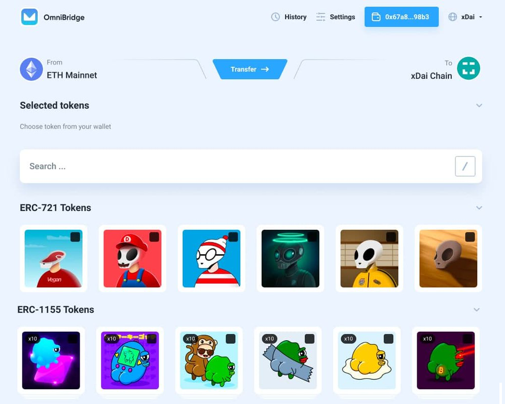

# Base Roadmap

## 2022 Roadmap in Process

The token merge between STAKE and Gnosis Chain will result in some new directions and roadmap items for 2022. The best place to check current happenings is on the [Gnosis Forum](https://forum.gnosis.io/c/dao/gips/21).

A few scheduled and completed items are below.

_Last update: April 19, 2022 |_ [_Changelog_](./#change-log)__

## Gnosis Chain & Gnosis Beacon Chain Landing Pages

:dart: **Target Date:** Q1 2022\
&#x20;**✅ Status:** Phase 1 Completed, Phase 2 ongoing

**Phase 1**

* Gnosis Beacon Chain: [https://www.gnosischain.com/](https://www.gnosischain.com/)
* Gnosis Chain: [https://www.gnosischain.com/evm](https://www.gnosischain.com/evm)

**Phase 2**

The Gnosis website at [https://gnosis.io/](https://gnosis.io/) will be revamped to include new info, branding and an overhaul of the site structure and message.

## GNO Liquid Staking

:dart: **Target Date:** Q1 2022\
&#x20;**✅ Status:** Completed March 29, 2022

Stakewise offers liquid staking for the Gnosis Beacon Chain, creating opportunities for stakers with any amount of GNO to participate in the process. Learn more here:



## HF to address token re-entrancy

:dart: **Target Date:** Q2 2022\
&#x20;**✅ Status:** Completed April 20, 2022

Following hacks of the Agave and Hundred Finance protocols a hardfork was scheduled to update previously bridged tokens.

[https://forum.gnosis.io/t/gip-31-should-gnosis-chain-perform-a-hardfork-to-upgrade-the-token-contract-vulnerable-to-the-reentrancy-attack/4134](https://forum.gnosis.io/t/gip-31-should-gnosis-chain-perform-a-hardfork-to-upgrade-the-token-contract-vulnerable-to-the-reentrancy-attack/4134)

## Gnosis Chain - Gnosis Beacon Chain Merge

:dart: **Target Date:** Q3 2022\
&#x20;:ballot\_box\_with\_check: **Status:** Planned

The merge is planned to correspond with the Ethereum merge to join the consensus layer and execution layers. Timing is still being determined as the process moves forward with Ethereum and the associated testnets.

## 2021 Base Roadmap

We continue to add items and adjust priorities as the year unfolds. See the [2020 Roadmap](2020-roadmap-completed-items.md) for items completed in 2020, and the changelog for any adjustments and additions.

__


The xDai project roadmap is a high-level strategic plan designed to guide xDai research and development. **Target dates and details are reviewed regularly by the team and subject to move, adjust and change as the project evolves**. Note that only completed items ( :white\_check\_mark: Status: Complete) are considered achieved project milestones.

If you have a direction you would like the xDai team to explore on our roadmap, consider adding a [post to our forum](https://forum.poa.network/c/xdai-chain/xdai-proposals/43) to begin the discussion.


## EasyStaking, POSDAO and Liquidity Pool Analytics

:dart: **Target Date**: Q1 2021\
&#x20; **✅ Status:** MVP Complete. Additions and improvements ongoing.&#x20;

* Dune Analytics [Staking Dashboard](https://www.duneanalytics.com/maxaleks/xdai-staking) (includes EasyStaking & POSDAO; additional metrics ongoing)
* LP [Distributions dashboard](https://stake-reward-distribution.xdaichain.com/)
* DappQuery [EasyStaking Dashboard](https://dappquery.com/dapp/easystaking-10047)

Analytics or EasyStaking rewards Liquidity Pool (LP) participants, stakers in the EasyStaking protocol and POSDAO stakers. [Rewards fluctuate based on numerous factors](../../for-stakers/staking-with-gno-on-the-gnosis-beacon-chain/stake-token/easy-staking/#liquidity-pool-lp-participants), and additional analytics and dashboards for LPs will be useful for determining staking strategies, reviewing historical outcomes and viewing current statistics.&#x20;

We will integrate statistics views for the EasyStaking platform and POSDAO as well as develop additional analytics tools (currently exploring options like Dune Analytics). We will continue to add stats and views for stakers on all platforms.

## **Establish Bug Bounty for High Value Contracts**

:dart: **Target Date:** Q2 2021\
&#x20; **✅Status:** Program Established with [Immunefi](../../for-developers/immunefi-bug-bounty.md)

The first bounty is for OmniBridge contracts with a potential reward of $2,000,000 for critical bug discovery. We will continue to add additional bounties for other infrastructure including EasyStaking and POSDAO consensus contracts.

## **Improve STAKE Governance Processes**

:dart: **Target Date:** Q2 2021\
&#x20; **✅Status:** Improved [Snapshot Compatibility](https://snapshot.org/#/xdaistake.eth) with xDai, process optimizations ongoing. [More Details](../../for-users/governance/)

STAKE is used for community signaling with [snapshot](https://snapshot.org/#/xdaistake.eth), and STAKE held on xDai is important for this process to reflect community sentiment. STAKE holders on xDai include POSDAO delegators and validators, perhaps the biggest supporters of the chain. There is a vital need to include these holders in the governance process. Snapshot compatibility will be expanded to include STAKE on xDai and STAKE currently staked in the POSDAO protocol. In addition, the governance process will be optimized to facilitate more community driven proposals and voting for the [Ecosystem Fund allocation](broken-reference).

## OmniBridge Phase 2

:dart: **Target Date**: Q1-Q2 2021\
&#x20; **✅** **Status:** [Security Audit](https://docs.tokenbridge.net/about-tokenbridge/security-audits#omnibridge-audit-by-chainsecurity) Completed by Chain Security April 27, 2021

Additional features include bi-directional support (ability to move tokens minted on xDai to Ethereum), relayTokensAndCall functionality, and additional decentralization mechanisms (governance, additional validators, user-enabled signature execution).&#x20;

## **Berlin HF activation and client updates**

:dart: **Target Date:** May 2021\
&#x20; **✅ Status Update:** **Completed May 17, Block #16101500**

OpenEthereum is now running `3.2.5` and it includes the latest xDai POSDAO features. xDai validators will upgrade to the latest build, with several also migrating to the Nethermind client to support client diversity on xDai. &#x20;

Following the Berlin HF, the gas limit per block was raised from 12.5M to 17M, resulting in 30%+ additional space on the xDai chain. Theoretical TPS for simple transactions at 160+ per second, in practice at 90 per second.

## **POSDAO Staking Application Improvements**

:dart: **Target Date:** Q2 2021\
&#x20;**✅Complete:** Security Audit Published June 25, 2021

[POSDAO v0.2.2](https://github.com/poanetwork/posdao-contracts/releases/tag/v0.2.2) was released on March 18, 2021 and is now in queue for an additional security audit. POSDAO support is now included with the latest [OpenEthereum release](https://github.com/openethereum/openethereum/releases/tag/v3.2.5).  Additional validator pool metadata was added to the interface.

## Universal NFT Bridge

:dart: **Target Date**: Q3 2021\
:white\_check\_mark: **Status:** Beta complete July 27, 2021

An NFT bridge to allow users easy portability between xDai and Ethereum for all ERC721 tokens. This will improve interoperability and provide options for NFT minting and cross-chain transfers.


_Update: Bridge is fully operational_  [_More information_](../../for-users/bridges/nft-omnibridge.md)__


## **xDai Grant Program Submissions**

:dart: **Target Date:** Q2**-**Q3 2021\
:white\_check\_mark: **Status:** [Early submissions now accepted](broken-reference) as of July 1, 2021 for Wave 1 of Grants Program.&#x20;

We will begin accepting applications for developers and projects requiring support for wave 1 of the Grants Program. Grants awards are TBD as we compile the early submissions and will announce once the program is live.

## L2 scalability and composability for token transfers on xDai

:dart: **Target Date**: Research ongoing, no definitive end date.

:white\_check\_mark: **Status:** Phase 1 complete with [AOX Arbitrum implementation on xDai](../../for-developers/developer-resources/aox-arbitrum-on-xdai.md).&#x20;

We will research adopting other platforms such as Polkadot, Cosmos, Eth2 and [optimistic rollups](https://docs.ethhub.io/ethereum-roadmap/layer-2-scaling/optimistic\_rollups/) deployed to xDai to implement a scalability solution on xDai. This will enable scaling of transfers (up to 1000x) for native tokens and synthetic tokens on top of xDai.&#x20;

## EIP-1559 Implementation

:dart: **Target Date**: Q3-Q4 2021\
:white\_check\_mark: **Status:** HF November 12, 2021

Following a successful test phase, we will activate the London Hardfork including [EIP 1559](https://eips.ethereum.org/EIPS/eip-1559) on xDai. This will change the fee structure to include a Base Fee for transactions. More on the [EIP-1559 integration on xDai](eip-1559.md).

## Beacon Chain

:dart: **Target Date**: Q4 2021\
:white\_check\_mark: **Status:** Gnosis Beacon Chain implemented. Explorer: [https://beacon.gnosischain.com/](https://beacon.gnosischain.com/)

In addition to the EIP-1559 implementation we are preparing a beacon chain deployment. Previous POSDAO validators will have the opportunity to become validators on this beacon chain implementation with a very small allocation of mGNO (32). This will mark a first step towards additional decentralization and allow anyone to participate in the beacon chain experience. The chain will be initially be supported 2 client implementations, Lighthouse and Prysm. [_More details_](../../for-validators/consensus/sbc.md)__

## **Privacy Preserving Transactions**

:dart: **Target Date:** Q4 2021\
:ballot\_box\_with\_check: **Status:** In process, defining requirements and exploring approaches

Implementation of additional zero-knowledge protocols and private transactions into xDai.

Since xDai is a stable token, the primary use of the chain is peer-to-peer payments. Just as with cash, privacy and anonymity should be an option when exchanging money or paying vendors for services.&#x20;

Currently, [Tornado.cash](https://tornado.cash/) is available to users to ensure Dai anonymity on the Ethereum mainnet. Dai can be used with tornado.cash before and after bridging to xDai to ensure transaction anonymity. However, it is not yet available directly on xDai.

We plan to research and implement privacy preserving transactions on xDai directly, as well as enable privacy for STAKE transactions, allowing for anonymous staking on xDai and Ethereum. We have invested in several [different approaches ](https://forum.poa.network/t/introducing-the-poa-zero-knowledge-fund/2698)to implement different ZK protocols into xDai based applications and wallets.


Update: We are currently working on a [ZeroPool](https://zeropool.network/) integration with the bridge infrastructure to provide transaction encryption capabilities.


## Eth 2 Post-Merge Trustless Bridge&#x20;

:dart: **Target Date**: 2022

A primary need in a multi-chain environment is a secure, cross-chain communication channel. We will begin work on a mechanism to connect two independent ETH2.0 chains and their respective execution layers (e.g. a bridge between ETH2.0 and [SBC](https://www.xdaichain.com/for-validators/consensus/sbc)). This bridge will rely directly on beacon chain validators to synchronize blocks between chains.

## Change Log

| Update       | Items                                                                                                                                                                                                                                                  |
| ------------ | ------------------------------------------------------------------------------------------------------------------------------------------------------------------------------------------------------------------------------------------------------ |
| 24.05.2022   | <ul><li>Remove POSDAO phase 3 &#x26; Synthetic Asset Research</li></ul>                                                                                                                                                                                |
| _19.04.2022_ | <ul><li>Added 2022 items/placeholder</li></ul>                                                                                                                                                                                                         |
| _15.11.2021_ | <ul><li>Update EIP-1559 / London HF to complete </li></ul>                                                                                                                                                                                             |
| _03.11.2021_ | <ul><li>Update L2 Scalability to Complete with AOX implementation</li><li>Adjust target dates for synthetic assets implementation</li><li>Add trustless bridge implementation</li></ul>                                                                |
| _27.07.2021_ | 

<ul><li>Update NFT Omnibridge Beta to complete</li><li>Update Grant Program submissions to complete</li><li>Add STAKE Beacon chain roadmap item</li></ul>                                                                                       |
| _13.07.2021_ | 

<ul><li>Update POSDAO improvements to complete</li><li>Update several target dates to reflect current status</li></ul>                                                                                                                          |
| _19.05.2021_ | 

<ul><li>Update Berlin HF to complete</li><li>Adjust date for NFT Omnibridge to Q2-Q3, add UI prototype image</li><li>Adjust EIP1559 to Q2-Q3</li></ul>                                                                                          |
| _07.05.2021_ | 

<ul><li>Update OmniBridge Phase 2 to complete</li></ul>                                                                                                                                                                                         |
| _06.05.2021_ | 

<ul><li>Add date confirmation for Berlin HF</li></ul>                                                                                                                                                                                           |
| _13.04.2021_ | 

<ul><li>Move Synthetic Asset Exploration to Q4.</li><li>Add ZeroPool integration to private transactions item.</li><li>Add POSDAO Staking Application Improvements (ongoing).</li><li>Add EIP 1559 test implementation.</li></ul>               |
| _06.04.2021_ | 

<ul><li>Add Improve STAKE governance process</li><li>Adjust target dates for synthetic assets &#x26; private txs</li><li>Add Berlin Hard Fork</li></ul>                                                                                         |
| _18.03.2021_ | <ul><li>Separate 2020 and 2021 Roadmaps to their own pages</li><li>Added <a href="broken-reference">Ecosystem Fund Roadmap</a> as secondary page</li><li>Add Bug Bounty Program</li><li>Add Grants Program</li><li>Update to NFT Bridge item</li></ul> |
| _04.01.2021_ | 

<ul><li>Organize 2020 items to completed, add preliminary 2021 Items</li><li>Adjust target dates for some 2021 items</li><li>Add NFT bridge</li></ul>                                                                                           |
