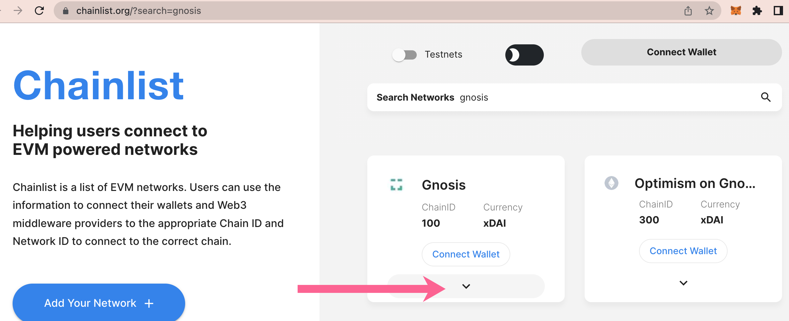
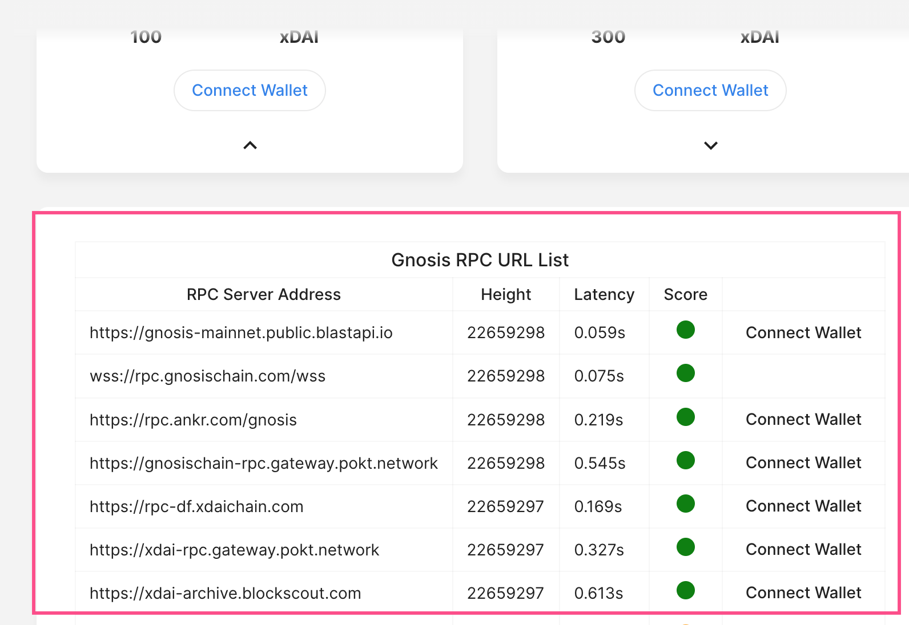
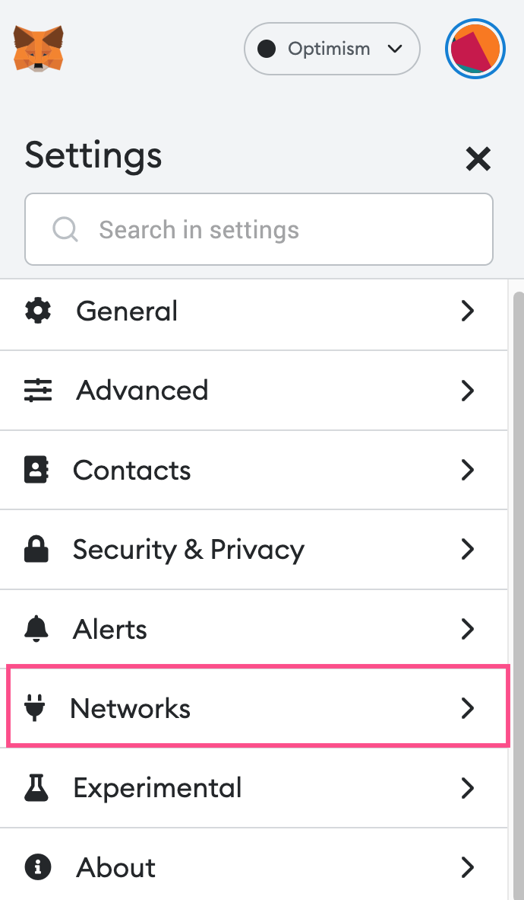
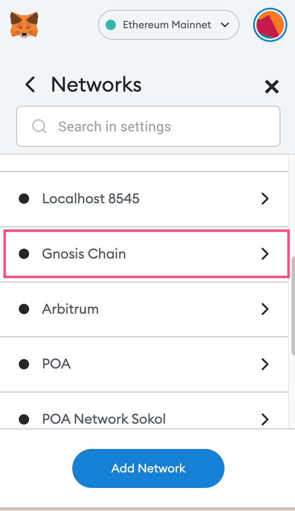
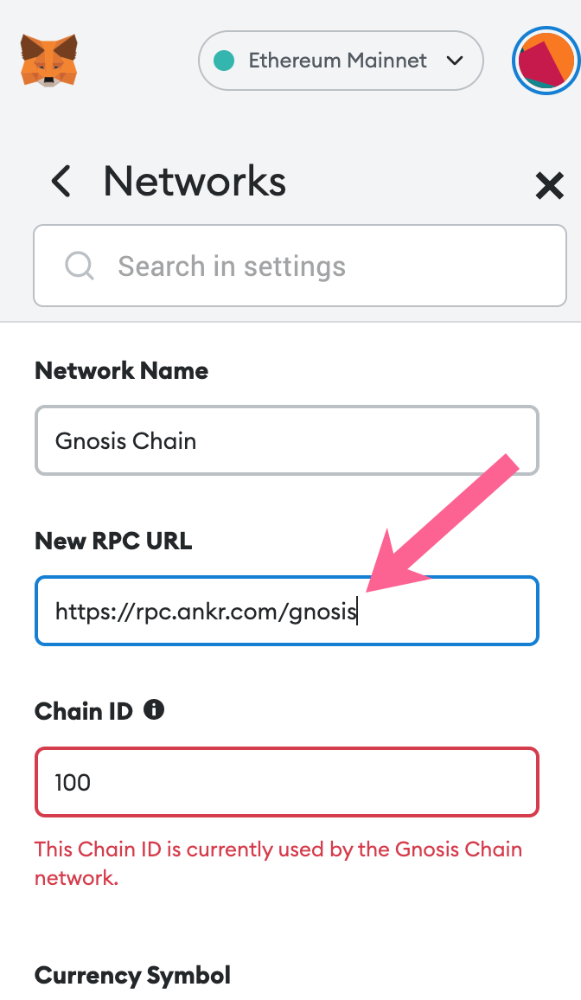
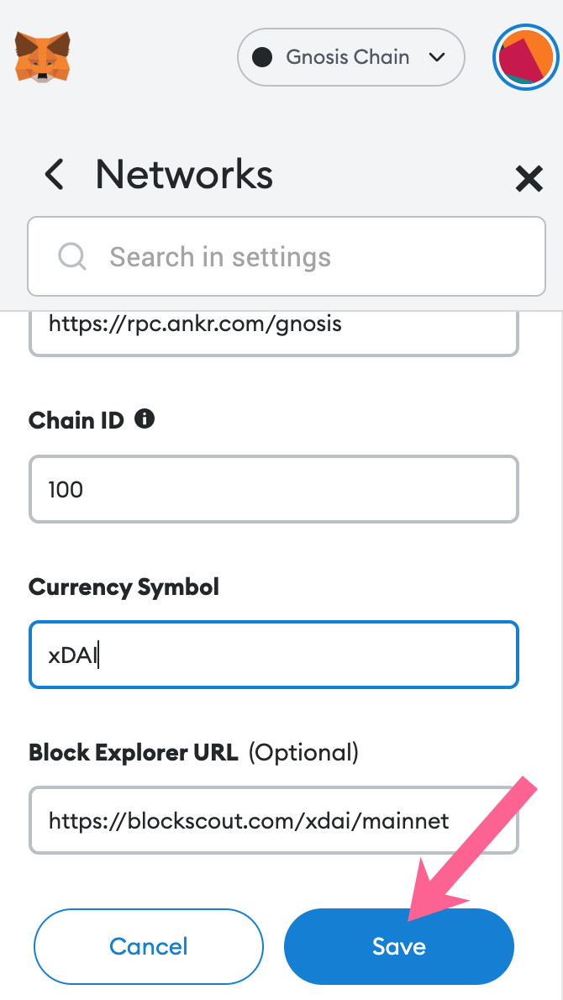

# Update RPC URL


The previous xDai endpoint, [rpc.xdaichain.com](http://rpc.xdaichain.com/) and sub-urls such as [https://rpc.xdaichain.com/oe-only](https://rpc.xdaichain.com/oe-only) are no longer supported and MUST BE UPDATED.


There are several network endpoints available for the Gnosis Chain. For a list of active RPCs see [https://chainlist.org/?search=gnosis](https://chainlist.org/?search=gnosis).&#x20;

Current supported public node providers include:

* [https://rpc.gnosischain.com](https://rpc.gnosischain.com)
* [https://rpc.ankr.com/gnosis](https://rpc.ankr.com/gnosis)
* [https://gnosischain-rpc.gateway.pokt.network](https://gnosischain-rpc.gateway.pokt.network)
* [https://gnosis-mainnet.public.blastapi.io](https://gnosis-mainnet.public.blastapi.io)

In addition to updated from unsupported urls, you may want to update your Gnosis Chain RPC if you are experiencing difficulties connecting to the chain or processing transactions.

Depending on your wallet or connection interface there are various ways to update the RPC. The most common wallet is Metamask, instructions to update your RPC are below.&#x20;


If you haven't added Gnosis Chain yet, you can do so with [Chainlist](https://chainlist.org/?search=gnosis) and do not need to update in MetaMask.


## Update RPC in MetaMask

### 1) Open MetaMask, Click on your account and scroll down to settings.

.png>)

### **2) Select Networks.**

### 3) Select your Gnosis Chain instance.

### 4) Update to a new RPC URL. Choose a performant url from [Chainlist](https://chainlist.org/?search=gnosis).

### 5) Scroll down to Save. MetaMask will now connect to the new RPC URL.

