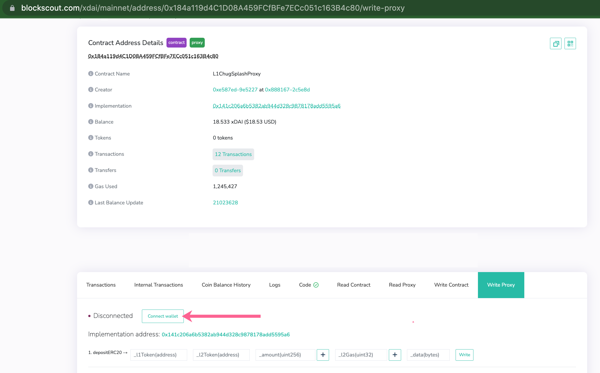
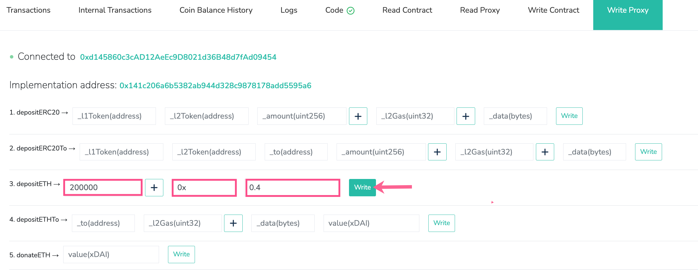

# Optimism: Optimistic Rollups on GC

An Optimism implementation is now deployed on Gnosis Chain. With this setup, Gnosis Chain functions as the L1 (akin to Ethereum) and Optimism on GC as the L2.&#x20;

Deployment processes are similar to using [Optimism with Ethereum](https://community.optimism.io/) with updated configs to match the Gnosis chain setup.


:droplet:[Optimism on Gnosis Chain (OGC) faucet](https://www.gimlu.com/faucet)


| Parameter                        | Value                                                                         |
| -------------------------------- | ----------------------------------------------------------------------------- |
| Network Name                     | Optimism on Gnosis Chain                                                      |
| Chain ID                         | 300                                                                           |
| RPC Endpoint                     | https://optimism.gnosischain.com                                              |
| WebSocket Endpoint               | wss://optimism.gnosischain.com/wss                                            |
| Block Explorer                   | [https://blockscout.com/xdai/optimism](https://blockscout.com/xdai/optimism)  |
| L1 (GC) Contract Addresses       | [L1 Addresses](l1-contract-addresses.md)                                      |
| L2 (Optimism) Contract Addresses | [L2 Addresses](l2-contract-addresses.md)                                      |

## Make a Deposit 

Deposits are initiated through the [Proxy\_\_OVM\_L1StandardBridge contract](https://blockscout.com/xdai/mainnet/address/0x184a119d4C1D08A459FCfBFe7ECc051c163B4c80/transactions) on the Gnosis Chain with the **`depositETH`** method and the following inputs:

* \_l2Gas: **`200000`**
* data: **`0x`**
* value: **`Deposit value in xDai (ie. 0.1 = 0.1 xDai)`**


Smart contract wallets are blocked from calling the `depositETH (and depositERC20) methods`. If you want to deposit using a smart contract wallet you can use the `depositETHTo function instead.`


### Example using BlockScout

1\) Go to \
[https://blockscout.com/xdai/mainnet/address/0x184a119d4C1D08A459FCfBFe7ECc051c163B4c80/write-proxy](https://blockscout.com/xdai/mainnet/address/0x184a119d4C1D08A459FCfBFe7ECc051c163B4c80/write-proxy)

2\) Connect a web3 wallet like MetaMask that contains some xDai for funding and gas fees.

3\) Scroll down to the **`depositETH`** method and enter the following:

* \_l2Gas: **`200000`**
* data: **`0x`**
* value: **`Deposit value in xDai`**` `_`(in this example we deposit 0.4 xDai to Optimism on GC)`_
* Click **Write** and complete the transaction with your wallet.


It may take several minutes for the deposit to be processed and the balance to update on the Optimism on GC Chain.


## Graph Protocol 

When starting the graph-node the network key is: **`optimism`**

* Graph [https://graph-optimism.gnosischain.com/](https://graph-optimism.gnosischain.com/)
* Admin [https://admin-graph-optimism.gnosischain.com/](https://admin-graph-optimism.gnosischain.com/)
* Playground [https://playground-graph-optimism.gnosischain.com/](https://playground-graph-optimism.gnosischain.com/)
* Ipfs [https://ipfs-graph-optimism.gnosischain.com/](https://ipfs-graph-optimism.gnosischain.com/)


If your subgraph is failing, query the subgraph health using the [GraphiQL Playground](https://graphiql-online.com/).


## &#x20;

\

