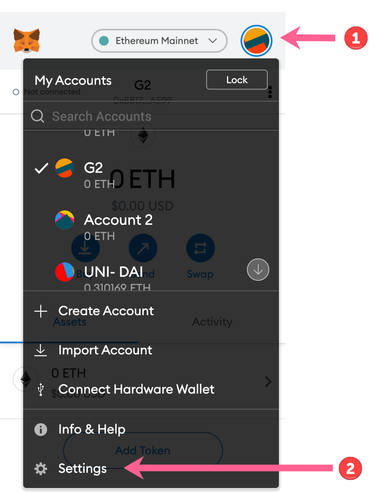
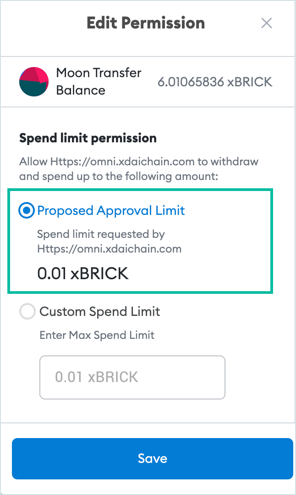
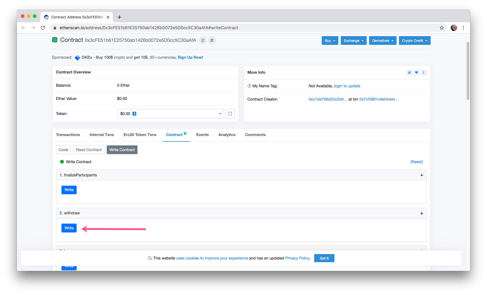

# Manual Instructions - Private Investors


STAKE token address on Ethereum [0x0Ae055097C6d159879521C384F1D2123D1f195e6](https://etherscan.io/token/0x0Ae055097C6d159879521C384F1D2123D1f195e6)

Private investor token contract\
[0x3cFE51b61E25750ab1426b0072e5D0cc5C30aAfA](https://etherscan.io/address/0x3cFE51b61E25750ab1426b0072e5D0cc5C30aAfA)


## Release Schedule

* Initial funds available 29.04.2020 for withdrawal (25% released)
* New funds available 27.05.2020 (10%) and each day following for the next 224 days. To transfer any available funds, you must follow the withdrawal process (pull strategy).


If you have already setup MetaMask, skip to the [Manual Instructions](https://www.xdaichain.com/for-stakers/stake-token/get-stake/manual-instruction-private-investors#manual-instructions-use-etherscan-to-transfer-stake-to-your-wallet)


## MetaMask


If using a hardware wallet to store your tokens (Ledger, Trezor) you can connect it to MetaMask rather than importing your account.  Connecting MetaMask instructions: [https://metamask.zendesk.com/hc/en-us/articles/360020394612-How-to-connect-a-Trezor-or-Ledger-Hardware-Wallet](https://metamask.zendesk.com/hc/en-us/articles/360020394612-How-to-connect-a-Trezor-or-Ledger-Hardware-Wallet)


1\) Import your account to MetaMask. This is the account you used to obtain STAKE as an Advisor or Private Investor. You can use the private key or JSON file to import (or Connect Hardware Wallet).

.png>)

2\) Add a small amount of ETH to your account to cover transactions (.05 recommended).

3\) Add the STAKE token to your wallet

a) Click on the top left Menu 三  then press **Add token**

b)  Click the  **Custom Token** item and enter in the STAKE Token address. The remaining details will autopopulate. Click **Next**. &#x20;

* STAKE Token Address: [0x0Ae055097C6d159879521C384F1D2123D1f195e6](https://etherscan.io/token/0x0Ae055097C6d159879521C384F1D2123D1f195e6)

c) Click **Add Tokens** to add to your wallet view. You will have 0 STAKE tokens to start. In the next steps, you will add STAKE to your wallet.

.png>)

## Manual Instructions: Use Etherscan to transfer STAKE to your wallet

4\) Go to the following address on Etherscan.\
[https://etherscan.io/address/0x3cFE51b61E25750ab1426b0072e5D0cc5C30aAfA#writeContract ](https://etherscan.io/address/0x3cFE51b61E25750ab1426b0072e5D0cc5C30aAfA#writeContract)&#x20;

5\) Connect MetaMask. Click on **Connect to Web3** and click **Connect**  on the MetaMask popup.&#x20;

.png>)

6\) In Etherscan, press the **Write** button next to the **withdraw** function.

7\) Confirm the transaction details in MetaMask.


**Note**: If transaction fails, see the [unlock instructions](broken-reference) below


8\) Click **View your transaction** to see transaction details


Once the transaction is processed, you should see your STAKE token amount in MetaMask, and can transfer/send as you would any other ERC20 token


**If MetaMask shows that your withdrawal transaction fails, try to unlock funds first:**

### **Unlock Instructions**

* Go to the following address on Etherscan: [https://etherscan.io/address/0x9BC4a93883C522D3C79c81c2999Aab52E2268d03#writeContract](https://etherscan.io/address/0x9BC4a93883C522D3C79c81c2999Aab52E2268d03#writeContract)
* Connect MetaMask. Click on **Connect to Web3** and click **Connect** on the MetaMask popup.
* In Etherscan, find **makeInstallment** point, enter in **3** in **\_pool** text box, and then press the **Write** button:

.png>)

* After your **makeInstallment** transaction is processed, repeat the steps above (starting from the step 4) to call the **withdraw** function.
