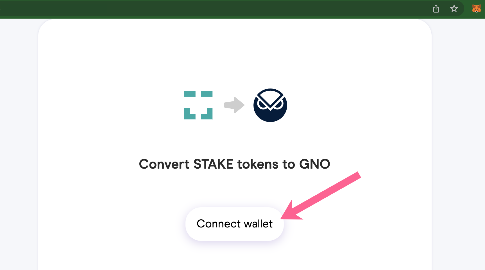
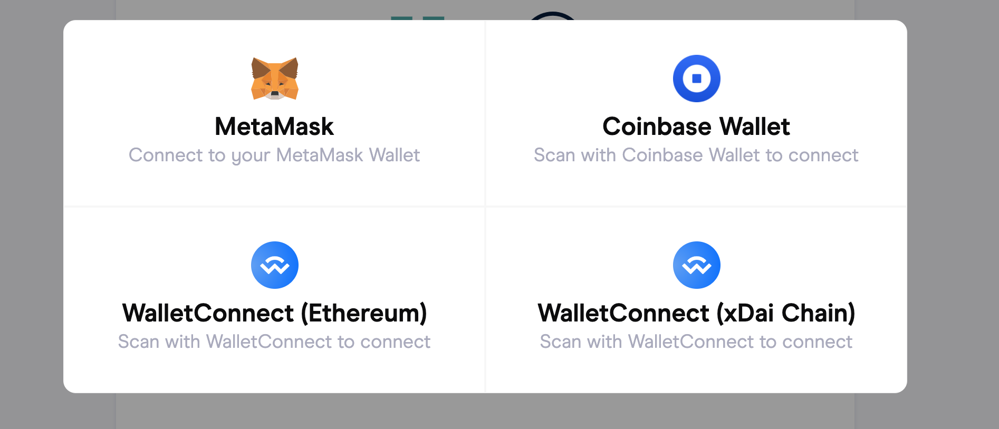
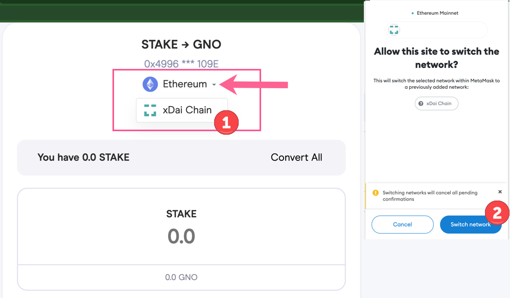
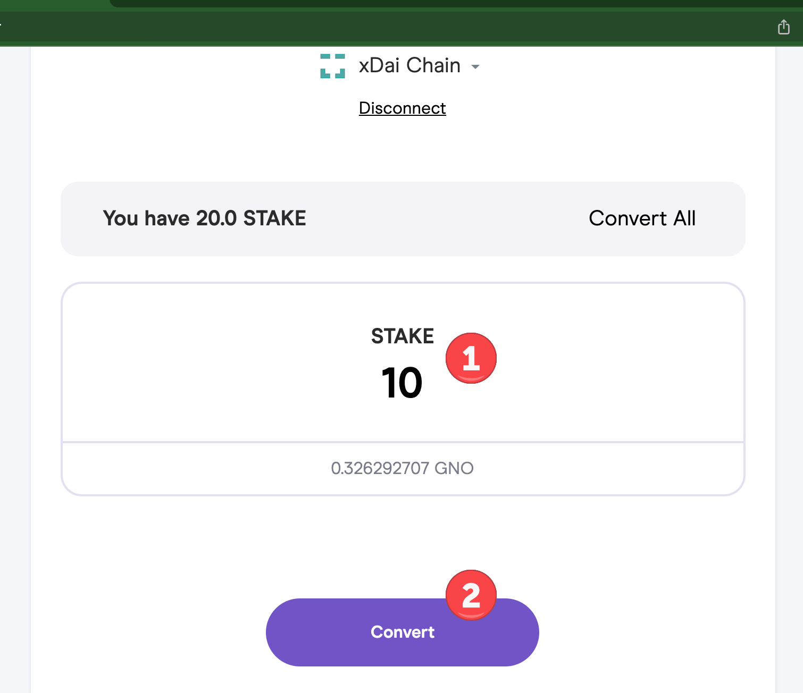
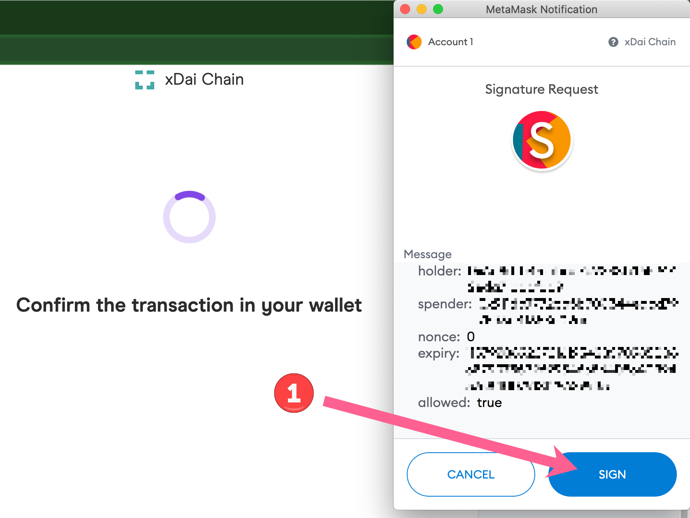
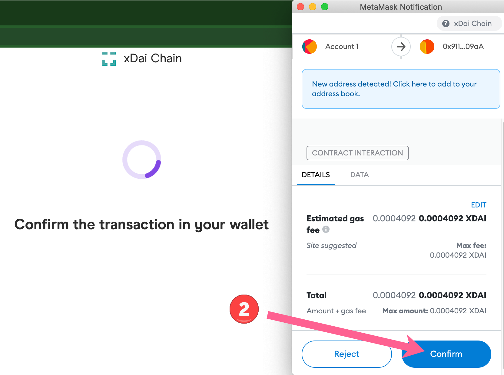
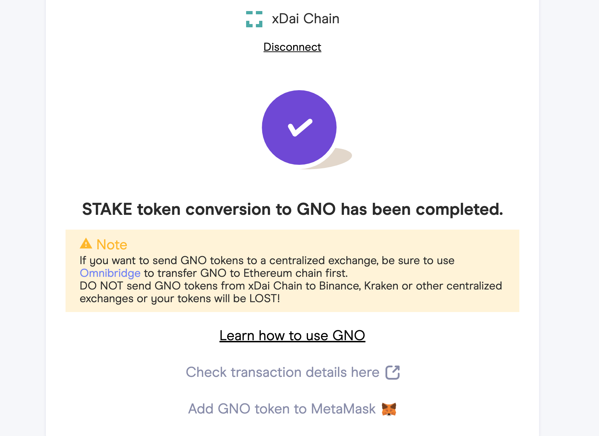

# STAKE / GNO Swap (completed)


**Token Merger Completed**\
****STAKE to GNO swap has completed. xDai Chain is now Gnosis Chain. For further information, read more at: [https://www.gnosischain.com/evm](https://www.gnosischain.com/evm)

Info below is for archival purposes only.


## Details

* Swap is live and available through Q2, 2022. **Expires May 31, 2022.**
* Swap rate is fixed at 1 STAKE to 0.0326292707 GNO
* Tokens can be swapped on the **Gnosis Chain only!**
* Bridge STAKE from Ethereum to the Gnosis Chain [using the OmniBridge.](https://omni.gnosischain.com/bridge)
* Analytics: [Swaps on Ethereum & Gnosis Chain](https://dune.xyz/maxaleks/STAKE-GNO-merge)
* More information: [Gnosis proposal and amendments](https://forum.gnosis.io/t/gip-16-gnosis-chain-xdai-gnosis-merge/1904).

## Instructions

STAKE is available to swap with GNO on the Gnosis Chain or the Ethereum Network. Instructions are similar for both Networks, you will connect your Wallet to the network you are swapping on, then proceed with the swap.

You will need a small amount of xDai to pay gas fees and complete the swap.

## 1. Swap STAKE to GNO on Gnosis Chain

### 1) Go to swap application at [https://stake-to-gno.xdaichain.com/](https://stake-to-gno.xdaichain.com)

Press Connect wallet.

### 2) Select your wallet application of choice.

In this example we use MetaMask connected to the Gnosis Chain. Note you must have MetaMask enabled in your extensions to see this option.


\*\*If you are using a hardware wallet, make sure the firmware is up to date.\*\*


### 3) Select xDai chain from the dropdown menu.


xDai Chain is the former name of the Gnosis Chain and is referenced in the UI. Networks settings etc are identical.


If using on Ethereum and connected to GC, use the same dropdown to switch between chains. STAKE values will be shown for the chain you are connected to.

### 4) Enter the amount you want to swap

Click **Convert All** to exchange all. After entering an amount, click Confirm to proceed.

You will need a small amount of xDai to process the transaction. If needed, you can get some at the community faucet at [https://xdai-app.herokuapp.com/faucet](https://xdai-app.herokuapp.com/faucet)

### 5) Confirm Transactions in MetaMask.

First transaction for signature request, 2nd to confirm the transfer.

### 6) Transaction is initiated and should be completed shortly.

From this final screen you can:

1. Check Transaction Details: Click to view In BlockScout (xDai) or Etherscan (Ethereum).
2. Add GNO to MetaMask: Click to add GNO token to your MetaMask wallet.

## Resources

GNO to STAKE Swap Contract on Gnosis Chain (formerly xDai):\
[0x918a1f8eE8F8f9E0802071929ce5fe9EfF60aC8C](https://blockscout.com/xdai/mainnet/address/0x918a1f8eE8F8f9E0802071929ce5fe9EfF60aC8C/transactions)\\

GNO to STAKE Swap Contract on Ethereum Mainnet:\
[0x7f30a53f290fc551a089bd83107906be649a92bd](https://etherscan.io/address/0x7f30a53f290fc551a089bd83107906be649a92bd)\\

GNO Address on Gnosis Chain (formerly xDai):\
[https://blockscout.com/xdai/mainnet/token/0x9C58BAcC331c9aa871AFD802DB6379a98e80CEdb/token-transfers](https://blockscout.com/xdai/mainnet/token/0x9C58BAcC331c9aa871AFD802DB6379a98e80CEdb/token-transfers)\
\
GNO Address on on Ethereum Mainnet:\
[https://etherscan.io/token/0x6810e776880c02933d47db1b9fc05908e5386b96](https://etherscan.io/token/0x6810e776880c02933d47db1b9fc05908e5386b96)

STAKE Address on Gnosis Chain: [https://blockscout.com/xdai/mainnet/token/0xb7D311E2Eb55F2f68a9440da38e7989210b9A05e/token-transfers](https://blockscout.com/xdai/mainnet/token/0xb7D311E2Eb55F2f68a9440da38e7989210b9A05e/token-transfers)\
\
STAKE Address on Ethereum Mainnet:\
[https://etherscan.io/token/0x0Ae055097C6d159879521C384F1D2123D1f195e6](https://etherscan.io/token/0x0Ae055097C6d159879521C384F1D2123D1f195e6)
