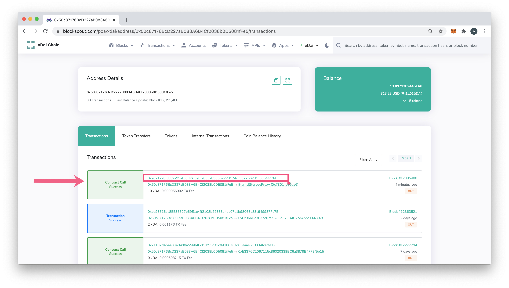
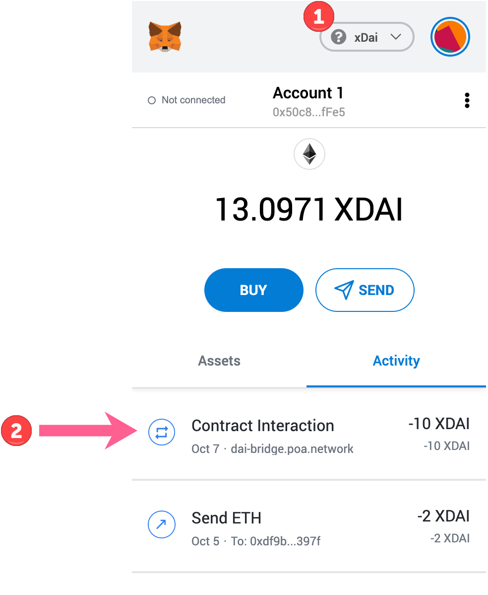
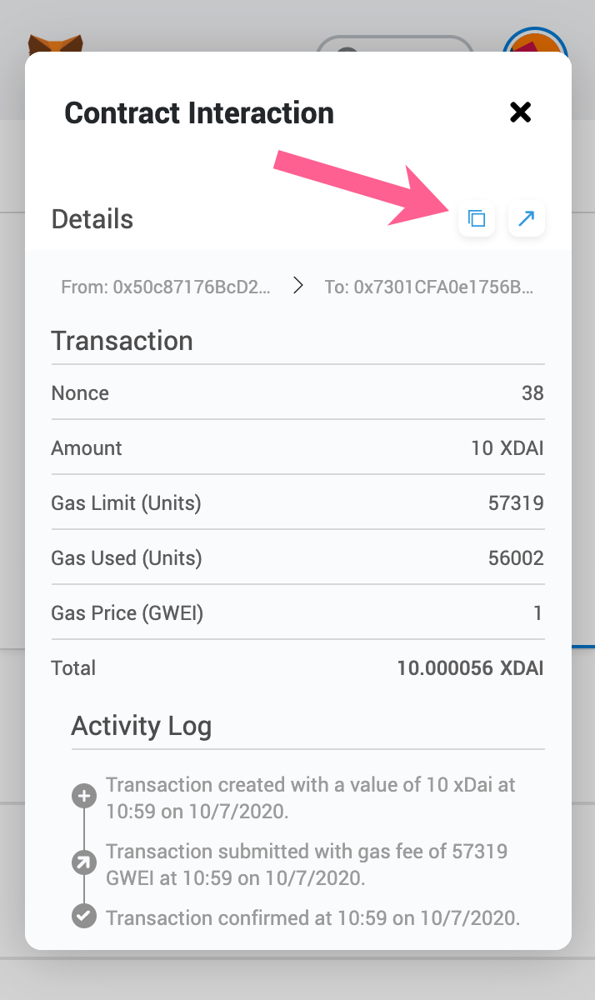

# Find a Transaction Hash

Completing a transfer from the xDai chain to Ethereum (converting xDai to Dai) requires 2 transactions.

1. Initial withdrawal on xDai. Signatures are collected and xDai is burned.
2. Claim Dai on Ethereum. Submit transaction hash containing validator confirmations. &#x20;

When transferring with the Bridge UI, the tx from step 1 is copied behind the scenes and used with the claim functionality in step 2.

In some cases, however, step 2 may not process, or a different method may be used (such as a direct transfer without the UI or with another UI like a burner wallet that does not include this claim functionality) and the claim must be processed manually.

## Find Transaction Hash in BlockScout

1\) Go to BlockScout at [https://blockscout.com/xdai/mainnet ](https://blockscout.com/xdai/mainnet)and enter the address that originated the transaction (typically your wallet address). If you were using a contract to interact with the bridge (in this case use the contract that called the relayToken method) enter that address.

2\) You will see the transaction in the list (tx sent from your address to the EternalStorageProxy contract (`0x7301CFA0e1756B71869E93d4e4Dca5c7d0eb0AA6`  ). Copy the tx hash.

## Find Transaction Hash in MetaMask

The process will be similar for other Ethereum wallets. Find your past transaction history and copy the tx hash for the Contract interaction.

1\) Go to MetaMask and connect to the **xDai Network**. [_Instructions for setting up MM with xDai_](../../wallets/metamask/metamask-setup.md).\
2\) Click on the Contract Interaction TX in the activity tab of your account.

3\) Copy the Transaction ID (hash).

