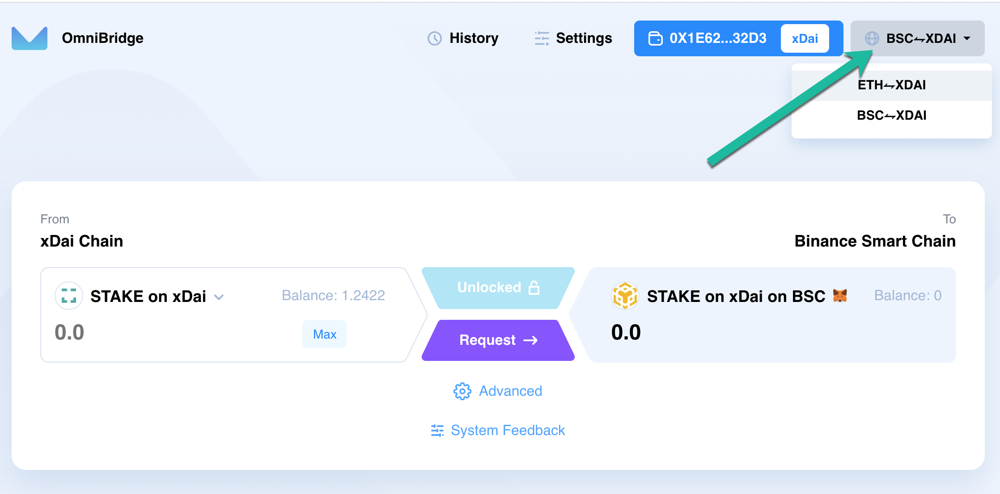

# Binance Smart Chain

The **Binance Smart Chain (BSC) Omnibridge** allows users to move ERC20 tokens between Gnosis Chain and BSC. It is available as a dropdown item from the OmniBridge UI.

See the submenu items for more:&#x20;

* [Converting WBNB to BNB automatically with a bridge transaction](wbnb-auto-conversion-to-bnb.md) (does not require BNB to process)
* [Using Component.Finance to exchange tokens to chain-compatible assets before bridging](dai-token-on-xdai-bsc.md)
* [Example bridge flow](bsc-omnibridge-example.md)&#x20;


**BSC OmniBridge and OmniBridge UI are beta software, use at your own risk.**

**You will need xDai and BNB on the Binance Smart Chain to complete a bridge transfer.**

**Bridge Interfaces**

🌉[OmniBridge live link](https://omni.gnosischain.com/)

🌉BSC [Transaction Monitor](https://alm-bsc-xdai.herokuapp.com/): Use it to see updated transaction status.

🌉[BSC tokens list](https://blockscout.com/xdai/mainnet/bridged-tokens/bsc)



Tokens bridged cross-chain are appended with the "on xDai" or "on BSC". There are instances where bridging across multiple chains creates token names such as "[STAKE on xDai on BSC](https://www.bscscan.com/token/0x24e5cf4a0577563d4e7761d14d53c8d0b504e337)" for example.\
\
Double bridging also can result in multiple instances of the same token on a single chain. For example, USDC can be bridged to xDai from Ethereum and also bridged to xDai from BSC. This results in 2 separate USDC token instances on xDai. These tokens cannot be merged into a single instance after they are minted.




[**Component.Finance**](https://xdai.component.finance/) is an available tool to swap between stable tokens. This can be used to convert:

* [Binance-Peg Dai Token](https://bscscan.com/token/0x1af3f329e8be154074d8769d1ffa4ee058b1dbc3) / [wxDai](https://blockscout.com/xdai/mainnet/tokens/0xe91D153E0b41518A2Ce8Dd3D7944Fa863463a97d/token-transfers)
* [Binance-Peg USDC Token](https://blockscout.com/xdai/mainnet/tokens/0xD10Cc63531a514BBa7789682E487Add1f15A51E2/token-transfers) / [USDC on xDai](https://blockscout.com/xdai/mainnet/tokens/0xDDAfbb505ad214D7b80b1f830fcCc89B60fb7A83/token-transfers).&#x20;

💡 [More info on this process is available here](dai-token-on-xdai-bsc.md).



You can view different instances in BlockScout - tokens are labeled with the ETH or BSC label depending on where they were bridged from.

* [Tokens bridged from Ethereum](https://blockscout.com/xdai/mainnet/bridged-tokens/eth)
* [Tokens bridged from BSC](https://blockscout.com/xdai/mainnet/bridged-tokens/bsc)


## Additional Information


Cross-Chain Bridging Tutorial



OmniBridge Docs

