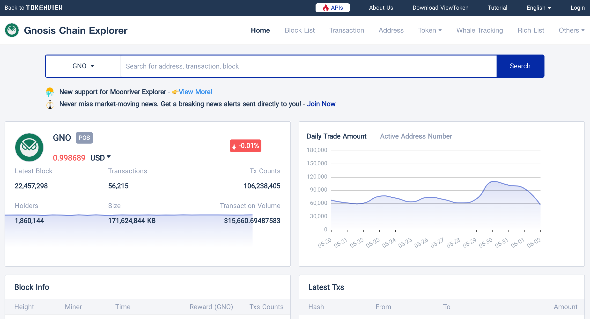

# Tokenview

Tokenview is an alternative explorer for the Gnosis Chain ecosystem with some unique features. It is available here: [https://xdai.tokenview.com/](https://xdai.tokenview.com/)

Features include:

* Token lists and transaction info for ERC20, ERC721 & ERC-1155s.
* Whale tracker and Rich list to track large transactions and holdlers.

