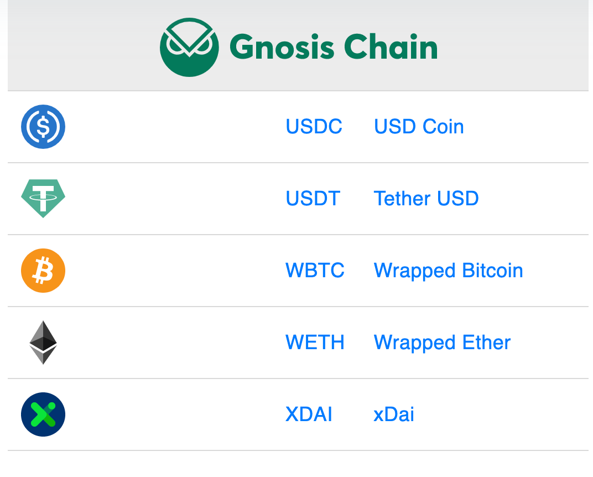
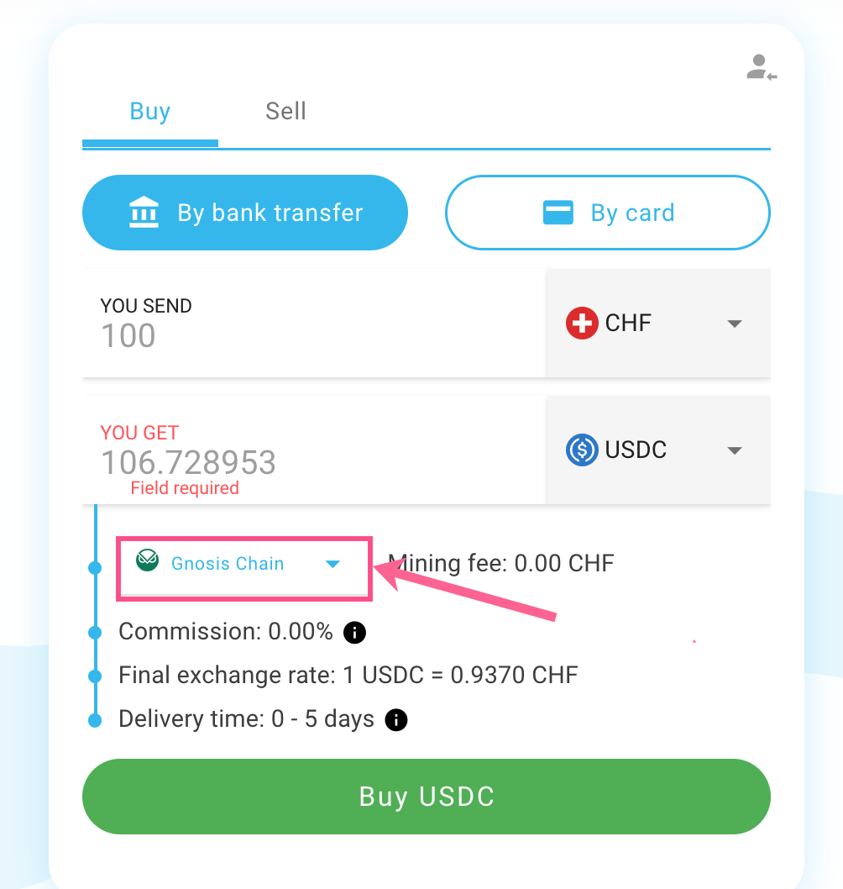

# Buy/Sell from Fiat

[Mt Pelerin](https://www.mtpelerin.com/currencies) provides the ability to buy/sell certain tokens directly on the Gnosis Chain without KYC and for very low fees. You can purchase with a bank transfer or credit card. [USDC](https://www.mtpelerin.com/buy-usd-coin-usdc), [USDT](https://www.mtpelerin.com/buy-tether-usdt), [WBTC](https://www.mtpelerin.com/buy-wbtc-wrapped-bitcoin), [WETH](https://www.mtpelerin.com/cryptocurrency/eth-ethereum-ether) and [XDAI](https://www.mtpelerin.com/buy-xdai) are all available to buy and sell.

Visit the page for the supported currency and select the Gnosis Chain to complete a buy/sell.&#x20;


Note buy/sell is [not available in some jurisdictions](https://www.mtpelerin.com/bridge-wallet/gnosis-wallet#countrieshttps://www.mtpelerin.com/bridge-wallet/gnosis-wallet#countries) including the US.&#x20;


