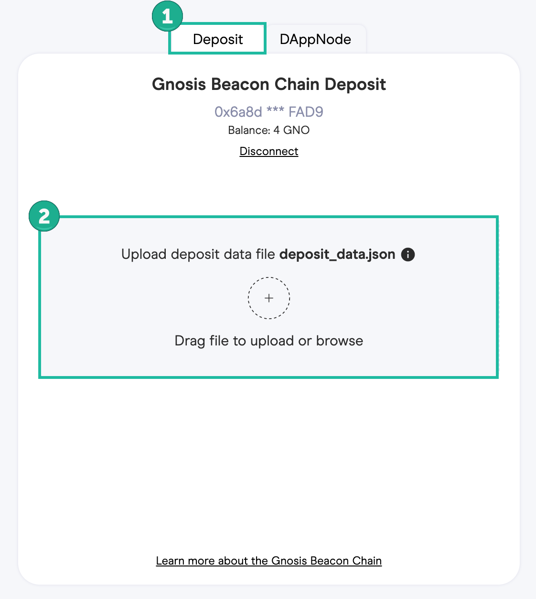
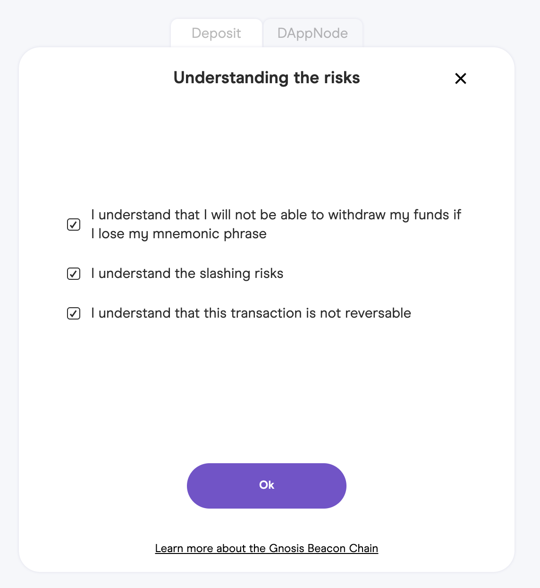
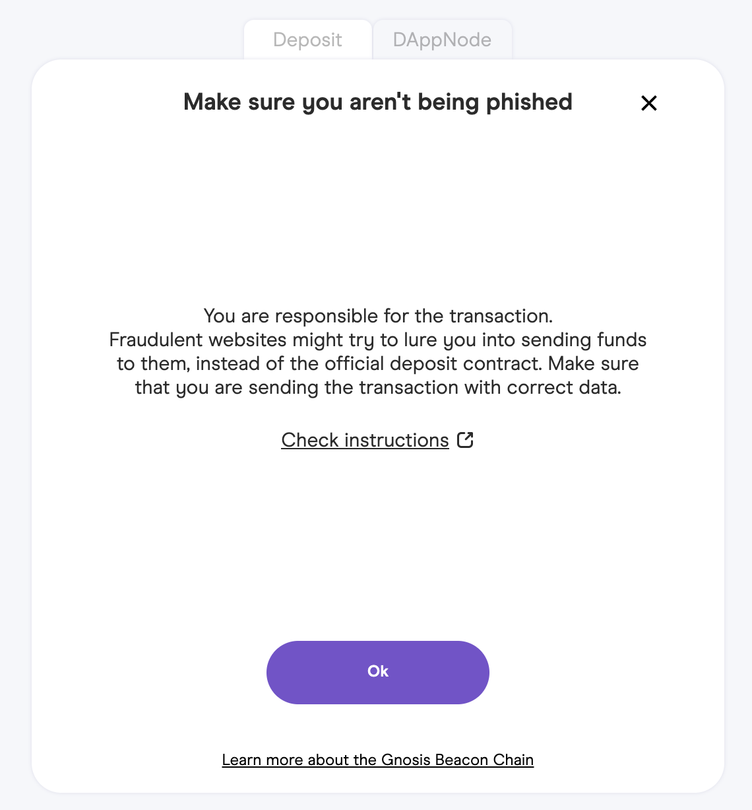
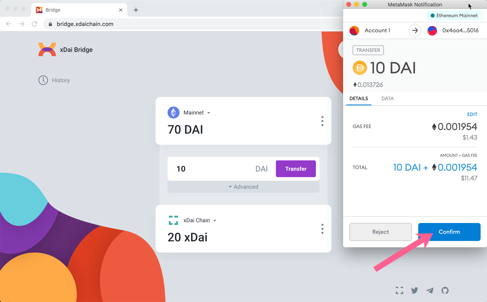

# Validator Deposits


Deposits occur on the Gnosis Chain (formerly xDai Chain). **If you have GNO on Ethereum mainnet, you will need to bridge it to GC**.&#x20;

* [Use the OmniBridge](https://omni.xdaichain.com/bridge) to move GNO from Ethereum to GNO on GC.&#x20;
* Add Gnosis Chain Network to your wallet with [https://chainlist.org/](https://chainlist.org) or [with these manual instructions](https://www.xdaichain.com/for-users/wallets/metamask/metamask-setup).



During the deposit, your GNO will be automatically wrapped into mGNO, the metatoken used for staking on the Gnosis Beacon Chain. **1 GNO = 32 mGNO required to run a validator**.  When [viewing your validator](./#view-your-validator) you will see deposit info in mGNO.


Once you have followed the steps to [Get Started](../get-started-node-setup/) and your Beacon Chain node is running, you will make a deposit of **1 GNO for each validator**. You can make a bulk deposit for up to 128 validators at a time.

## Deposit GNO

1\) Go to [https://deposit.gnosischain.com/](https://deposit.gnosischain.com) and connect your web3 wallet on the Gnosis Chain to the application. \
\
In this example we use MetaMask.

.png>)

.png>)

2\) Select the Deposit tab. Upload your `deposit_data.json` file from [step 1 in the Get Started section.](../get-started-node-setup/#step-1-generate-validator-account-s-and-deposit-data) It will be located in the same folder as the generated keystores.

2\) The app will validate the json file and list the number of validator deposits you are making and the required GNO to deposit. Click **Deposit** to continue.

3\) Check that you understand the risks and [ensure you are interacting with the correct contract](safety-instructions-for-the-deposit-via-deposit-app.md) before proceeding.

4\) Complete the deposit.&#x20;

## View your Validator


Following a successful deposit, the Gnosis Beacon Chain will wait for 1024 Gnosis Chain blocks plus up to 64 Gnosis Beacon Chain epochs before adding validators to the pool. **This means it will take approximately 1.5 hours before the validators start proposing and attesting blocks on the Gnosis Chain.**

Once live, you can view your validator(s) on the explorer. Copy the pubkey(s)  listed in the deposit\_data.json file (a key will be generated for each validator as "pubkey": "\<your-public-key>") and paste into the search box at [https://beacon.gnosischain.com/](https://beacon.gnosischain.com).



## Previous UI for mGNO to GNO swap

If you need some extra mGNO (for example to top off a balance or for other reasons), you can use the previous swap UI to convert any amount GNO on the Gnosis Chain to mGNO. [Instructions](convert-mgno-to-gno.md). Note that currently there is not a mechanism to swap mGNO back to GNO.&#x20;
