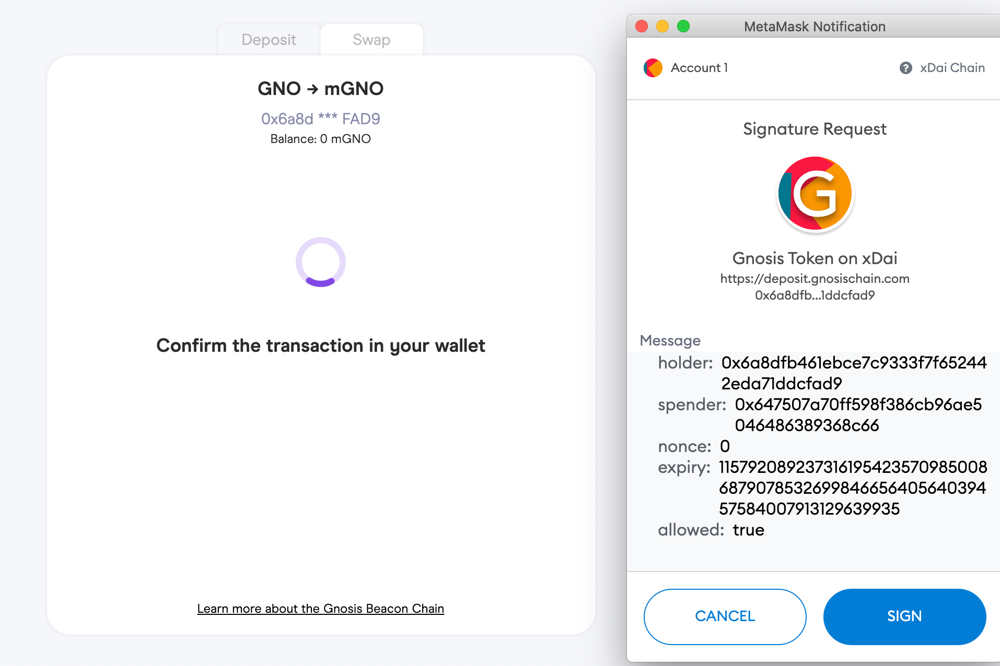
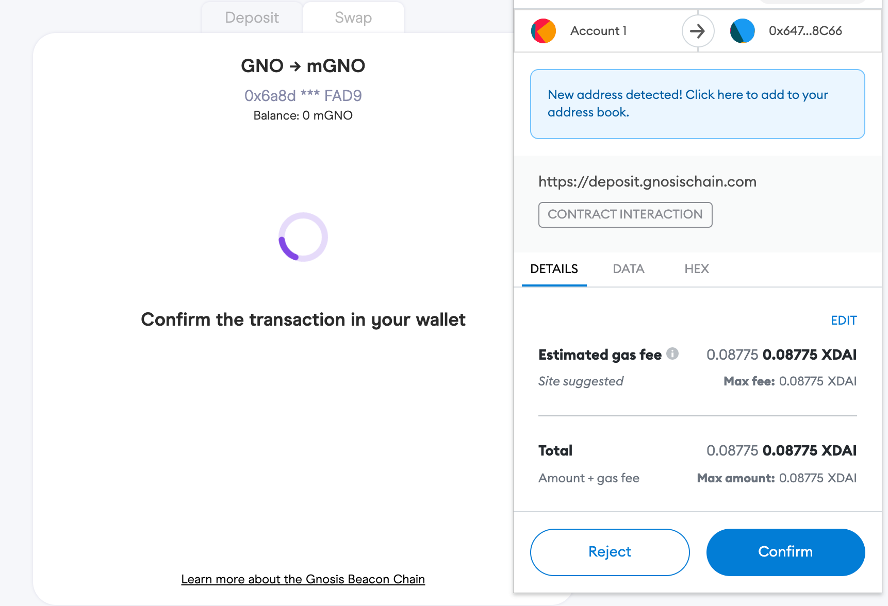
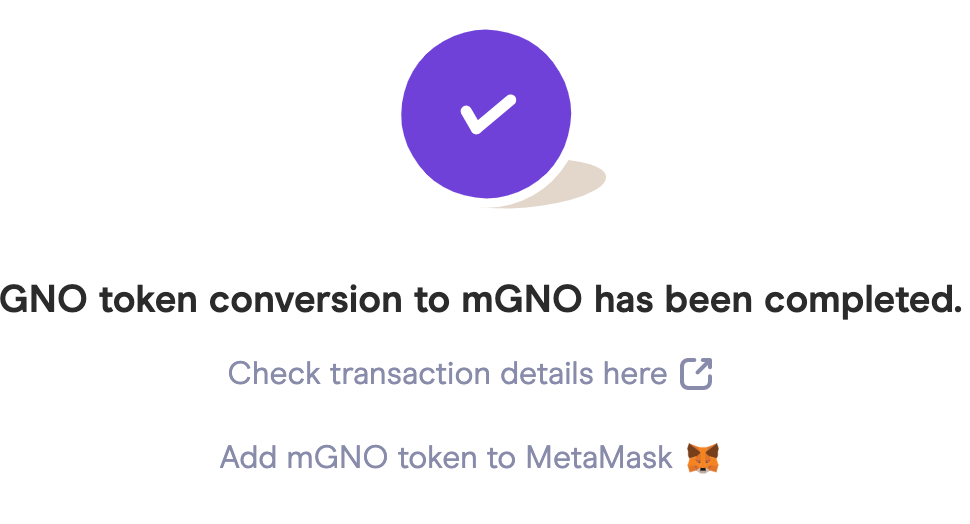
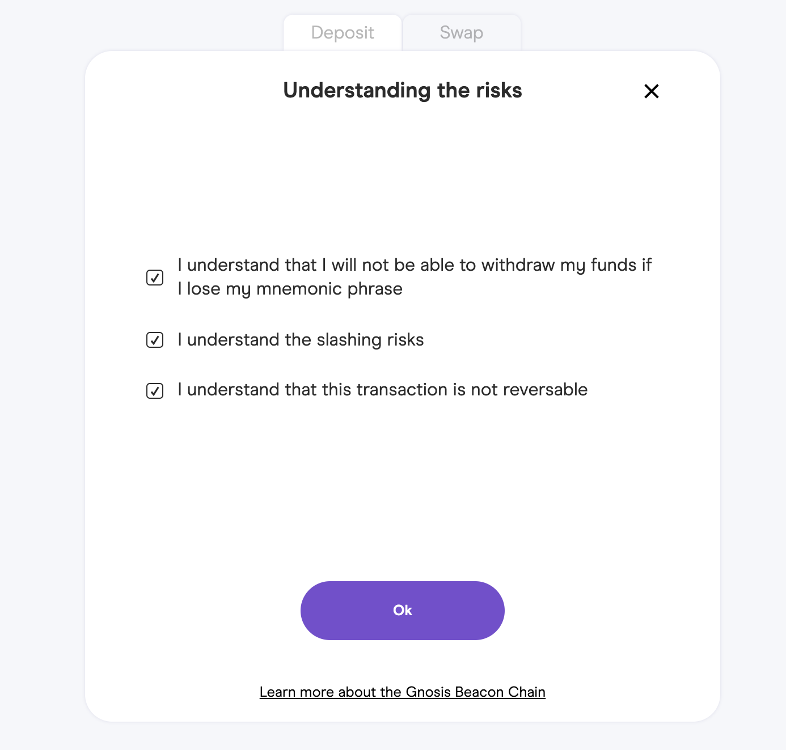
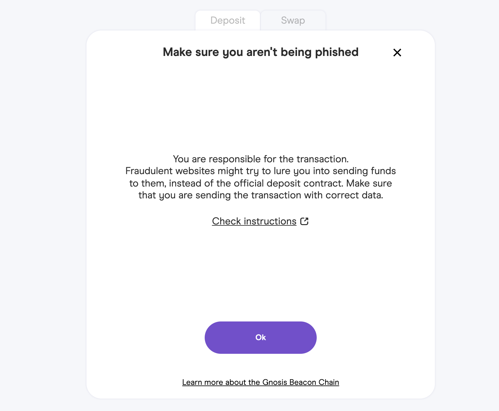
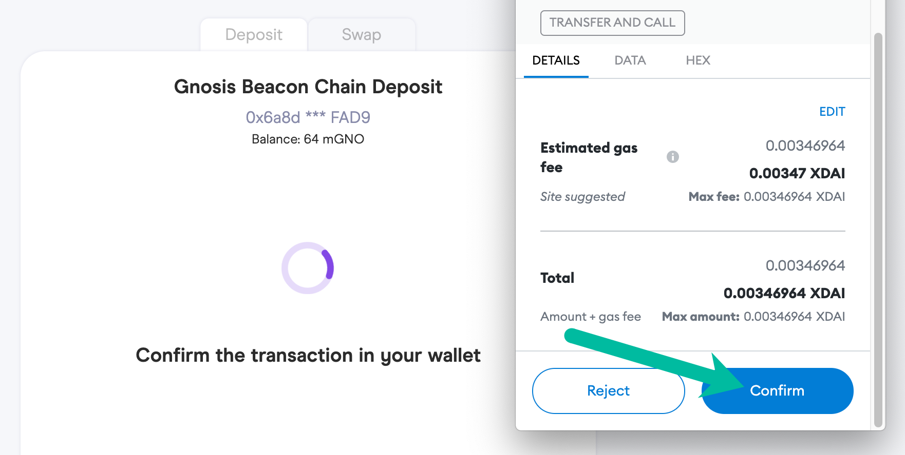

# Validator Deposits


Deposits occur on the Gnosis Chain (formerly xDai Chain). **If you have GNO on Ethereum mainnet, you will need to bridge it to GC**.&#x20;

* [Use the OmniBridge](https://omni.xdaichain.com/bridge) to move GNO from Ethereum to GNO on GC.&#x20;
* Add Gnosis Chain Network to your wallet with [https://chainlist.org/](https://chainlist.org) or [using these manual instructions](https://www.xdaichain.com/for-users/wallets/metamask/metamask-setup).


Once you have followed the steps to [Get Started](../get-started.md) and your Beacon Chain node is running, you will make a deposit of **32 mGNO for each validator**. You can make a bulk deposit for up to 128 validators at a time.

Making a deposit requires 2 steps. First, GNO must be converted to mGNO. For every 1 GNO, you will receive 32 mGNO.&#x20;

### 1) Convert GNO to mGNO

1\) Go to [https://deposit.gnosischain.com/](https://deposit.gnosischain.com) and connect your web3 wallet on the Gnosis Chain to the application. \
\
Your wallet should contain at least 1 GNO and a small amount of xDai to cover transactions. \
\
In this example we use MetaMask.

.png>)

.png>)

2\) Select the Swap tab. Enter the amount you would like to convert and click **Convert**. You will need to convert 1 GNO to 32 mGNO for each validator you are going to run.

3\) Sign 2 transactions in your wallet. The first is a free signature request to allow the application to make the conversion.

The second processes the transaction. This will require a small amount of xDai to complete.

4\) The transaction should be initiated and completed within a few seconds. Once completed you can click the link to see the tx in BlockScout and add mGNO to your MetaMask wallet.

### 2) Deposit mGNO


If you don't see the new amount of mGNO, refresh the application.


1\) Switch to the Deposit tab. Upload your `deposit_data.json` file from step 2 in the [Get Started section](../get-started.md#2-generate-validator-account-s-and-deposit-data). It will be located in the same folder as the generated keystores.

2\) App will validate the json file and with the number of validator deposits and required mGNO to deposit. Click **Deposit** to continue.

3\) Check that you understand the risks and [ensure you are interacting with the correct contract](safety-instructions-for-the-deposit-via-deposit-app.md) before proceeding.

4\) Complete the deposit.&#x20;


Following a successful deposit, the Gnosis Beacon Chain will wait for 1024 Gnosis Chain blocks plus up to 64 Gnosis Beacon Chain epochs before adding validators to the pool. **This means it will take approximately 1.5 hours before the validators start proposing and attesting blocks on the Gnosis Chain.**

Once live, you can view your validator(s) here: [https://beacon.gnosischain.com/](https://beacon.gnosischain.com)


\
